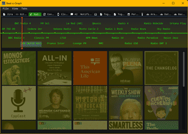

# Beatograph

Beatograph is meant to offer every tool of interest for DevOps professionals. It allows you to define dashboards that may include host definitions (those will automatically offer readings of node-exporter metrics, show and access docker containers available, and systemctl units), assertions (simple tests that allow us to quickly verify that things are "Go"), arbitrary command execution results from the local host, a remote host, or a container in a remote host; you may even parameterize commands with on-screen inputs.

For those who need to yield time and objective tracking data, it has convenient clients for Toggl and Jira.

It also features a screen with information about the local host. One with current time and weather in different locations. And an internet radio and podcast player.

At the time being, it will only build and run on Windows (sorry for that), but there are plans to soon build on GNU/Linux and MacOS.

## Features

- Define dashboards with host definitions.
- Automatic readings of node-exporter metrics.
- Access to Docker containers and systemctl units.
- Assertions for quick verification.
- Execution of arbitrary commands.
- Parameterized commands with on-screen inputs.
- Toggl and Jira clients.
- Local host information screen.
- Time and weather information for multiple locations.
- Internet radio and podcast player.

## Installation

For now, you will need to use CMake to build, and then make sure that you run it with the CWD at the root of the project (that will allow it to access the "assets" folder, images cache, etc).

## Contributing

We welcome contributions! Please read our [contributing guidelines](CONTRIBUTING.md) for more information.

## License

This project is licensed under the GNU General Public License v3.0. See the [LICENSE](LICENSE) file for details.

## Contact

For any questions or feedback, please contact [ignacionr on GitHub](https://github.com/ignacionr).
